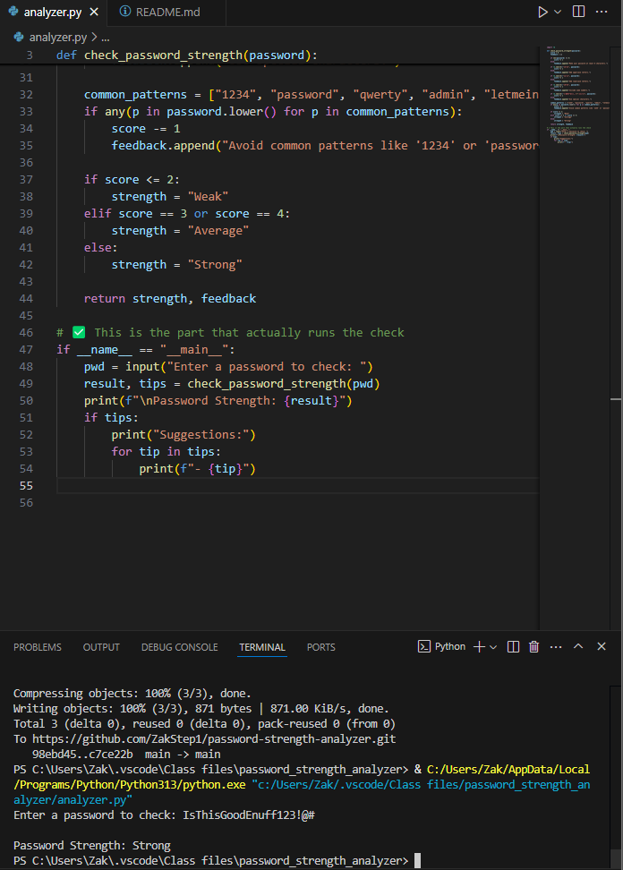
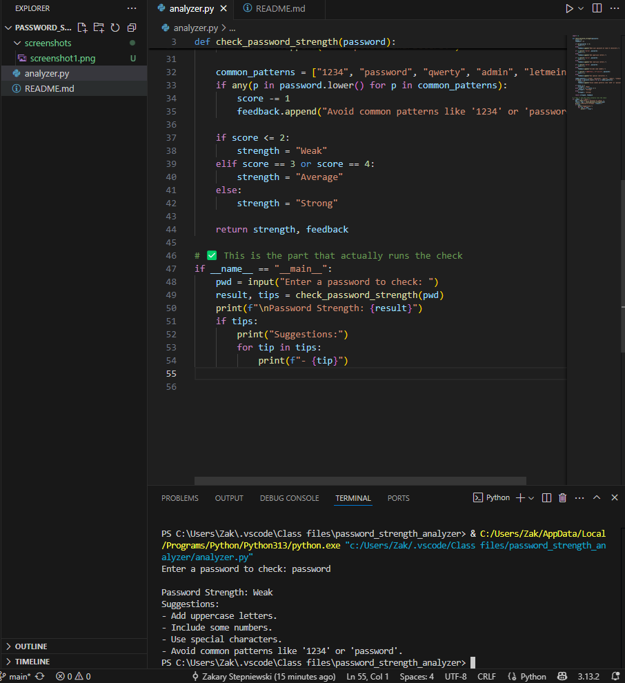
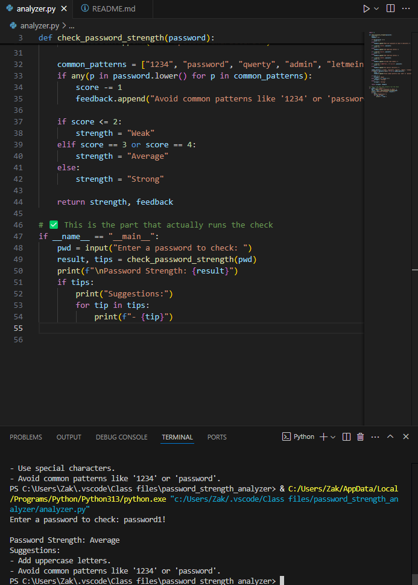

# Password Strength Analyzer

This is a Python script that checks how strong or weak a password is.  
It looks at things like length, use of uppercase and lowercase letters, numbers, special characters, and whether it contains common weak patterns (like "1234" or "password").

## Features

- Rates passwords as **Weak**, **Average**, or **Strong**
- Gives suggestions on how to improve a weak password
- Detects basic patterns commonly found in leaked or weak passwords
- Designed for real-world use, like during signups or password resets

## How to Use

1. Clone this repo or download the script.
2. Open a terminal in the project folder.
3. Run the script:

```bash
python analyzer.py
```

4. Enter a password when prompted.
5. The tool will return the password strength and tips for improvement.

## Requirements

- Python 3.x  
(No additional libraries required)

## Example Output

```text
Enter a password to check: Password123!
Password Strength: Average
Suggestions:
- Use special characters.
- Avoid common patterns like 'password'.
```

## Demo Screenshot





## Author

Zakary Stepniewski
